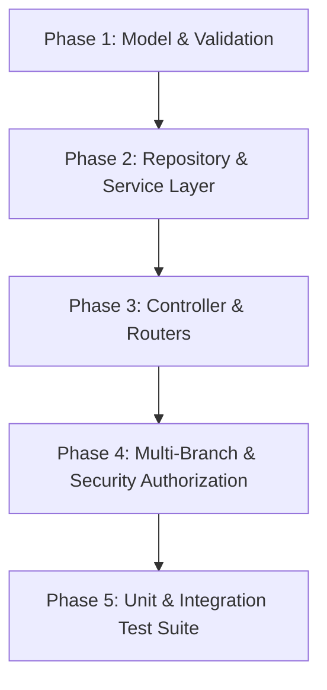

# Appointments Backend Contract-First Audit & Architecture Decision

**Module:** Salon ERP — Appointments Module  
**Status:** Audit & Architecture Decision Completed (Contract-First Baseline)  
**Date:** 2026-08-13  
**Scope:** Repository Audit, Security Invariants, Scoping, Status Machine, Scheduling, Conflict Strategy, Pricing, Walk-in vs. Advance Bookings, Notification Infrastructure, and Implementation Roadmap.

---

## 1. Repository Audit Findings

A rigorous search across the codebase (`src/models`, `src/routers`, `src/controllers`, `src/services`, `src/repositories`, `src/validation`, `src/config`) confirms the following regarding the **Appointments module**:

| Component Area | Status in Repository | Existing Implementation / Artifact |
| :--- | :--- | :--- |
| **Appointment Models / Schemas** | **DOES NOT EXIST** | No `appointment.model.js` or schema file present in `src/models`. |
| **Appointment Routers / Routes** | **DOES NOT EXIST** | No appointment router mounted in `app.mjs` or `src/routers`. |
| **Appointment Controllers** | **DOES NOT EXIST** | No appointment controller in `src/controllers`. |
| **Appointment Services** | **DOES NOT EXIST** | No appointment service in `src/services`. |
| **Appointment Repositories** | **DOES NOT EXIST** | No appointment repository in `src/repositories`. |
| **Appointment Zod Validation** | **DOES NOT EXIST** | No Zod schemas for appointments in `src/validation`. |
| **Frontend Appointment Code** | **DOES NOT EXIST** | No frontend codebase present in this repository. |
| **Database Indexes for Appointments** | **DOES NOT EXIST** | No indexes registered in MongoDB for appointments. |
| **RBAC Permissions** | **EXISTS (CONFIGURED)** | Configured in [permissions.js](file:///c:/Users/deves/Desktop/Projects/Saloon%20ERP/src/config/permissions.js#L129-L163) as `appointments.view`, `appointments.book`, `appointments.reschedule`, `appointments.assign_staff`, `appointments.update_status`, `appointments.cancel`. |
| **Auth / Org / Branch Scope Middleware** | **EXISTS (TESTED)** | [auth.js](file:///c:/Users/deves/Desktop/Projects/Saloon%20ERP/src/middleware/auth.js), [branchScope.js](file:///c:/Users/deves/Desktop/Projects/Saloon%20ERP/src/middleware/branchScope.js), [rbac.js](file:///c:/Users/deves/Desktop/Projects/Saloon%20ERP/src/middleware/rbac.js). |
| **Customer Entity & Relationships** | **EXISTS** | [customer.model.js](file:///c:/Users/deves/Desktop/Projects/Saloon%20ERP/src/models/customers/customer.model.js) (has `organizationId`, `homeBranchId`, `visitedBranchIds`, `status`). |
| **Staff Entity & Relationships** | **EXISTS** | [staff.model.js](file:///c:/Users/deves/Desktop/Projects/Saloon%20ERP/src/models/staff/staff.model.js) (has `organizationId`, `status`, `userId`). Note: `branchId` and `serviceId` mappings are managed via assigned relationships. |
| **Service Entity & Relationships** | **EXISTS** | [service.model.js](file:///c:/Users/deves/Desktop/Projects/Saloon%20ERP/src/models/services/service.model.js) (has `organizationId`, `branchId`, `duration` in minutes, `pricing.basePrice`, `taxConfiguration`, `status`). |
| **Notification Infrastructure** | **EXISTS (PARTIAL)** | BullMQ queues in [client.js](file:///c:/Users/deves/Desktop/Projects/Saloon%20ERP/src/queues/client.js) (`emailQueue`, `smsQueue`) and worker in [notification.worker.js](file:///c:/Users/deves/Desktop/Projects/Saloon%20ERP/src/workers/notification.worker.js). Currently handles auth OTP/credentials. Reminders infrastructure is not yet implemented. |

---

## 2. Existing Appointment Contract

Because no Appointment endpoints exist currently, the **Actual Contract found in the repository is: EMPTY (0 Endpoints)**.

All proposed endpoints in Section 12 & 13 represent the **Canonical First Contract** designed in exact alignment with project conventions (e.g. Leave, Customer, Service modules).

---

## 3. Domain Model Findings

### Core Domain Audit
- **Appointment Entity:** Must be created as `Appointment` in `src/models/appointments/appointment.model.js`.
- **Primary Identifier:** MongoDB `_id` (ObjectId).
- **Human Readable Identifier:** `appointmentCode` (String, generated via `Sequence` model following pattern `APT-YYYYMMDD-XXXX` per organization).

### Entity Field Specification & Source of Truth

| Field Name | Type | Req / Opt | Nullable | Validation | Default | Mutability | DB Representation | API Representation |
| :--- | :--- | :--- | :--- | :--- | :--- | :--- | :--- | :--- |
| `_id` | ObjectId | Req | No | Valid ObjectId | Auto | Immutable | `_id` | `id` |
| `appointmentCode` | String | Req | No | Trim, uppercase | Auto sequence | Immutable | `appointmentCode` | `appointmentCode` |
| `organizationId` | ObjectId | Req | No | Ref Organization | `req.user.organizationId` | Immutable | `organizationId` | `organizationId` |
| `branchId` | ObjectId | Req | No | Ref Branch, active, authorized | Target payload | Mutable (via Reschedule) | `branchId` | `branchId` |
| `customerId` | ObjectId | Req | No | Ref Customer, active, org-matched | Body payload | Immutable | `customerId` | `customerId` |
| `staffId` | ObjectId | Opt | Yes | Ref Staff, active, org-matched | `null` | Mutable | `staffId` | `staffId` |
| `services` | Array[Object] | Req | No | Min 1 service | `[]` | Mutable | `services` | `services` |
| `services.serviceId` | ObjectId | Req | No | Ref Service, active, branch-matched | Body | Immutable | `serviceId` | `serviceId` |
| `services.name` | String | Req | No | String | Service snapshot | Immutable | `name` | `name` |
| `services.duration` | Number | Req | No | Integer > 0 (mins) | Service snapshot | Immutable | `duration` | `duration` |
| `services.price` | Number | Req | No | Number >= 0 | Service snapshot | Immutable | `price` | `price` |
| `services.taxRate` | Number | Req | No | Number >= 0 | Service snapshot | Immutable | `taxRate` | `taxRate` |
| `appointmentDate` | String (ISO) | Req | No | YYYY-MM-DD format | Body | Mutable | `appointmentDate` | `appointmentDate` |
| `startTime` | String (HH:mm) | Req | No | HH:mm 24-hr format | Body | Mutable | `startTime` | `startTime` |
| `endTime` | String (HH:mm) | Req | No | Calculated: startTime + duration | Derived server-side | Mutable | `endTime` | `endTime` |
| `totalDuration` | Number | Req | No | Sum of service durations (mins) | Derived server-side | Mutable | `totalDuration` | `totalDuration` |
| `startAt` | Date | Req | No | UTC Timestamp | Derived server-side | Mutable | `startAt` | `startAt` |
| `endAt` | Date | Req | No | UTC Timestamp | Derived server-side | Mutable | `endAt` | `endAt` |
| `status` | String (Enum) | Req | No | Enum values | `"scheduled"` / `"in_progress"` | Mutable | `status` | `status` |
| `bookingType` | String (Enum) | Req | No | `"advance"`, `"walk_in"` | Body | Immutable | `bookingType` | `bookingType` |
| `pricing` | Object | Req | No | Object | Derived server-side | Mutable | `pricing` | `pricing` |
| `pricing.subtotal` | Number | Req | No | Sum of service base prices | Derived server-side | Mutable | `subtotal` | `subtotal` |
| `pricing.discount` | Number | Req | No | Number >= 0 | `0` | Mutable | `discount` | `discount` |
| `pricing.tax` | Number | Req | No | Sum of service tax amounts | Derived server-side | Mutable | `tax` | `tax` |
| `pricing.total` | Number | Req | No | `subtotal - discount + tax` | Derived server-side | Mutable | `total` | `total` |
| `notes` | String | Opt | Yes | Max 1000 chars | `""` | Mutable | `notes` | `notes` |
| `cancellation` | Object | Opt | Yes | Object | `null` | Mutable | `cancellation` | `cancellation` |
| `reminder` | Object | Opt | Yes | Object | Default schedule | Mutable | `reminder` | `reminder` |
| `isDeleted` | Boolean | Req | No | Boolean | `false` | Mutable | `isDeleted` | `isDeleted` |

---

## 4. Branch Security Invariant & Authorization

### Mandatory Invariant Enforcement
1. **"All Branches" is strictly a READ scope.**
   - When the active header `X-Branch-Id` is omitted (and user has `hasOrgWideAccess === true`), operations are strictly read-only (`GET /api/v1/appointments`).
2. **Target `branchId` is REQUIRED in every Appointment mutation body.**
   - Applies to: Create, Update, Reschedule, Status Change, Assign/Reassign Staff, Cancel, Reminder updates.
   - The backend MUST NEVER derive or infer the mutation branch from `X-Branch-Id` header, user context, customer home branch, or staff assignment.
3. **Server-Side Branch Authorization:**
   - Server verifies `req.user.organizationId` matches target `branch.organizationId`.
   - Server verifies target `branch.isActive === true`.
   - Server verifies `req.user` has access to target `branch` (either `hasOrgWideAccess === true` or target branch is present and active in `req.user.branchAccess`).

---

## 5. All-Branches Read vs. Mutation Matrix

| Operation | Allowed Branch Scope | Target `branchId` Requirement | Authorization Rule |
| :--- | :--- | :--- | :--- |
| **List Appointments** | Single Branch or All Branches | Optional query param `branchId`. Filtered by header `X-Branch-Id` if provided. | `appointments.view` |
| **Get Appointment Details** | Single Resource | Derived from database record. Resource must belong to user's organization and authorized branch access. | `appointments.view` |
| **Create Appointment** | Any Authorized Target Branch | **REQUIRED in request body** | `appointments.book` |
| **Update Appointment** | Resource Branch | **REQUIRED in request body** | `appointments.book` / `appointments.reschedule` |
| **Reschedule Appointment** | Resource Branch (or Target Branch) | **REQUIRED in request body** | `appointments.reschedule` |
| **Assign/Reassign Staff** | Resource Branch | **REQUIRED in request body** | `appointments.assign_staff` |
| **Change Status** | Resource Branch | **REQUIRED in request body** | `appointments.update_status` |
| **Cancel Appointment** | Resource Branch | **REQUIRED in request body** | `appointments.cancel` |
| **Update Reminder Config** | Resource Branch | **REQUIRED in request body** | `appointments.book` |

---

## 6. Calendar Scheduling & Timezone Strategy

### Timezone Representation Architecture Decision
- **Storage Standards:**
  - Date & Time boundaries store both calendar strings (`appointmentDate`: `"YYYY-MM-DD"`, `startTime`: `"HH:mm"`, `endTime`: `"HH:mm"`) AND canonical UTC JavaScript Date objects (`startAt`, `endAt`).
- **Timezone Context:**
  - Standard timezone defaults to `Asia/Kolkata` (IST, UTC+05:30) or Branch timezone if set.
- **Granularity & Rules:**
  - **Booking Granularity:** 15-minute intervals.
  - **Past Booking Policy:** Advance bookings in the past are rejected (`400 Bad Request`). Walk-ins allow immediate/past start for current day operating window.
  - **Overnight Appointments:** Not supported in v1 (appointments must start and complete within the same operating calendar day `00:00` - `23:59`).

---

## 7. Staff Allocation & Availability

### Staff Constraints & Rules
1. **Staff Assignment:** Optional at initial booking (allows unassigned appointments queue), but required before status can move to `in_progress` or `completed`.
2. **Staff Branch Alignment:** Assigned staff must be an active staff member belonging to the appointment's `organizationId`.
3. **Staff Status Check:** Inactive (`status: "inactive"`) or suspended (`status: "suspended"`) or soft-deleted staff cannot be assigned.
4. **Staff Leave Check:** Server verifies staff member does NOT have an approved or pending leave on `appointmentDate` (integrates directly with existing `Leave` model).

---

## 8. Service Relationship, Duration & Financial Integrity

### Pricing Snapshot Architecture Decision (CRITICAL)
- **Snapshot Integrity:** Services undergo base price and tax configuration changes over time. To ensure financial integrity and legal auditability, an appointment **MUST store a complete pricing snapshot** of each service at the moment of booking.
- **Snapshot Structure:**
  ```json
  "services": [
    {
      "serviceId": "64abc...",
      "name": "Haircut & Styling",
      "duration": 45,
      "price": 500,
      "taxRate": 18
    }
  ]
  ```
- **Consequence Avoidance:** Historical appointments will remain completely unaffected when base catalog service prices or tax rates are modified later.

---

## 9. Appointment Status Lifecycle Machine

### Allowed Status Values
- `scheduled` (Default for advance bookings)
- `in_progress` (Service actively being performed / walk-in start)
- `completed` (Service finished and checked out)
- `cancelled` (Appointment revoked)
- `no_show` (Customer failed to show up)

### Status Transition Matrix

| Current Status | Allowed Next Statuses | Required Permission | State Mutation Rules |
| :--- | :--- | :--- | :--- |
| `scheduled` | `in_progress`, `cancelled`, `no_show` | `appointments.update_status` / `cancel` | Requires assigned staff before `in_progress`. |
| `in_progress` | `completed`, `cancelled` | `appointments.update_status` / `cancel` | Sets `completedAt` on `completed`. |
| `completed` | *TERMINAL* (None) | N/A | Completed appointments are IMMUTABLE. |
| `cancelled` | *TERMINAL* (None) | N/A | Cancelled appointments cannot be reopened. Must create new appointment. |
| `no_show` | *TERMINAL* (None) | N/A | No-show appointments are terminal. |

---

## 10. Walk-In vs. Advance Booking Workflows

### Booking Types
- `advance`: Scheduled for a future time slot. Requires full date/time conflict checking and optional reminder scheduling.
- `walk_in`: Created for immediate service execution. Initial status can be `scheduled` or directly `in_progress`.
- **Customer Requirement:** Guest/anonymous walk-ins are NOT permitted by core domain integrity. Walk-ins require selecting or creating a valid `Customer` record (supporting quick creation).

---

## 11. Concurrency Control & Overlap Detection Strategy

### Overlap Invariant
For any active appointment (status `scheduled` or `in_progress` and `isDeleted: false`):
- A staff member CANNOT have two overlapping appointments in time:
  $$\text{startAt} < \text{existingEndAt} \quad \text{AND} \quad \text{endAt} > \text{existingStartAt}$$

### Production-Grade Concurrency Serialization
To prevent race conditions where two concurrent requests pass application-level validation simultaneously:
- **MongoDB Multikey Covered Array Unique Index:**
  Similar to the Leave module concurrency solution (`dates` multikey index), Appointment will generate an array of 15-minute time slot keys:
  `slotKeys`: `["STAFF_<staffId>_2026-08-13T10:00", "STAFF_<staffId>_2026-08-13T10:15", ...]`
- **Unique Partial Index:**
  ```javascript
  appointmentSchema.index(
    { organizationId: 1, slotKeys: 1 },
    {
      unique: true,
      partialFilterExpression: {
        isDeleted: false,
        status: { $in: ["scheduled", "in_progress"] },
        staffId: { $type: "objectId" }
      }
    }
  );
  ```
  If a duplicate concurrent request attempts to book the same staff slot, MongoDB will throw a duplicate key error (code `11000`), which is caught server-side and transformed into a clean `409 Conflict` error.

---

## 12. Security Audit & Findings

| Risk Category | Classification | Description & Mitigation |
| :--- | :--- | :--- |
| **IDOR / Tenant Leakage** | **CRITICAL** | Handled: All database queries filter strictly by `organizationId: req.user.organizationId`. |
| **All-Branches Mutation Bypass** | **HIGH** | Handled: Requirement mandated that every state mutation requires explicit `branchId` in payload and server-side authorization check. |
| **Cross-Tenant Entity Access** | **HIGH** | Handled: `customerId`, `staffId`, and `serviceId` validated against user's `organizationId` and target `branchId`. |
| **Price / Duration Manipulation** | **HIGH** | Handled: Client cannot specify item total or pricing calculation. Frontend only sends `serviceId`s and optional `discount`; server calculates all pricing and duration snapshots. |
| **Race Conditions** | **HIGH** | Handled: Staff time slots serialized via MongoDB unique partial index on `slotKeys`. |

---

## 13. Final Recommended Architecture & API Contract

### API Endpoints

1. `POST /api/v1/appointments`
   - **Permission:** `appointments.book`
   - **Header:** `X-Branch-Id`
   - **Body:** `{ branchId, customerId, staffId?, services: [serviceId], appointmentDate, startTime, bookingType, notes?, discount? }`
   - **Response Status:** `201 Created`

2. `GET /api/v1/appointments`
   - **Permission:** `appointments.view`
   - **Header:** `X-Branch-Id` (Optional if `hasOrgWideAccess === true`)
   - **Query Params:** `page`, `limit`, `startDate`, `endDate`, `branchId`, `staffId`, `customerId`, `status`, `search`
   - **Response Status:** `200 OK` (Paginated list)

3. `GET /api/v1/appointments/:id`
   - **Permission:** `appointments.view`
   - **Response Status:** `200 OK`

4. `PUT /api/v1/appointments/:id`
   - **Permission:** `appointments.book` / `appointments.reschedule`
   - **Body:** `{ branchId, staffId?, services?, appointmentDate?, startTime?, notes?, discount? }`
   - **Response Status:** `200 OK`

5. `PATCH /api/v1/appointments/:id/status`
   - **Permission:** `appointments.update_status`
   - **Body:** `{ branchId, status: "in_progress" | "completed" | "cancelled" | "no_show", reason? }`
   - **Response Status:** `200 OK`

6. `PATCH /api/v1/appointments/:id/staff`
   - **Permission:** `appointments.assign_staff`
   - **Body:** `{ branchId, staffId }`
   - **Response Status:** `200 OK`

7. `DELETE /api/v1/appointments/:id`
   - **Permission:** `appointments.cancel`
   - **Body:** `{ branchId, reason? }`
   - **Response Status:** `200 OK` (Soft delete / Status cancelled)

---

## 14. Implementation Plan



### Steps:
1. **Model Definition:** Create [appointment.model.js](file:///c:/Users/deves/Desktop/Projects/Saloon%20ERP/src/models/appointments/appointment.model.js) with pricing snapshot, slotKeys multikey index, and indexes.
2. **Validation Schemas:** Create [appointment.validation.js](file:///c:/Users/deves/Desktop/Projects/Saloon%20ERP/src/validation/appointments/appointment.validation.js) with strict Zod validation.
3. **Repository Layer:** Create [appointment.repository.js](file:///c:/Users/deves/Desktop/Projects/Saloon%20ERP/src/repositories/appointments/appointment.repository.js).
4. **Service Layer:** Create [appointment.service.js](file:///c:/Users/deves/Desktop/Projects/Saloon%20ERP/src/services/appointments/appointment.service.js) handling pricing calculation, conflict detection, staff leave verification, and status transitions.
5. **Controller & Routers:** Create [appointment.controller.js](file:///c:/Users/deves/Desktop/Projects/Saloon%20ERP/src/controllers/appointments/appointment.controller.js) and [appointment.router.js](file:///c:/Users/deves/Desktop/Projects/Saloon%20ERP/src/routers/appointments/appointment.router.js), mounted in `app.mjs`.
6. **Tests:** Comprehensive Jest unit & integration test suite in `src/tests/appointments/`.

---

## 15. Open Decisions Requiring Approval

1. **Unassigned Staff Appointments:** Confirm whether appointments can be booked without an assigned staff member initially (`staffId: null`), requiring staff assignment prior to marking `in_progress`. *(Recommended: Allowed)*.
2. **Slot Key Resolution Granularity:** Standardize time slot conflict resolution on 15-minute intervals. *(Recommended: 15-minute intervals)*.
