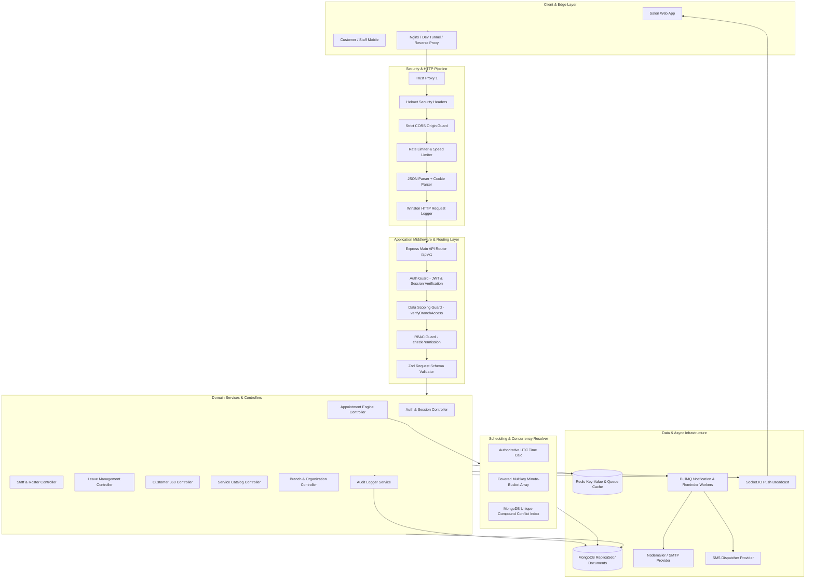
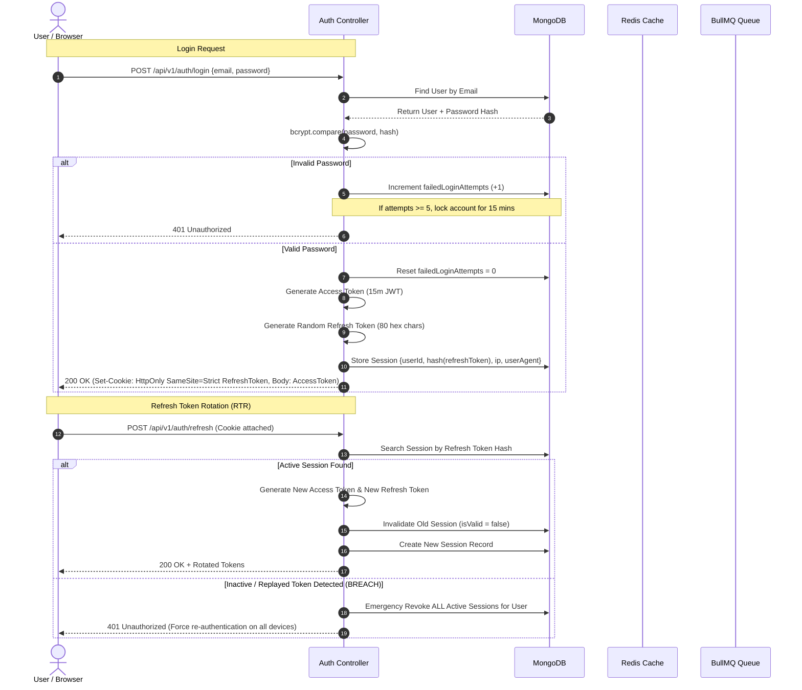
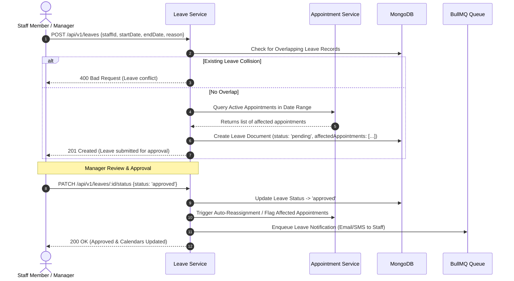
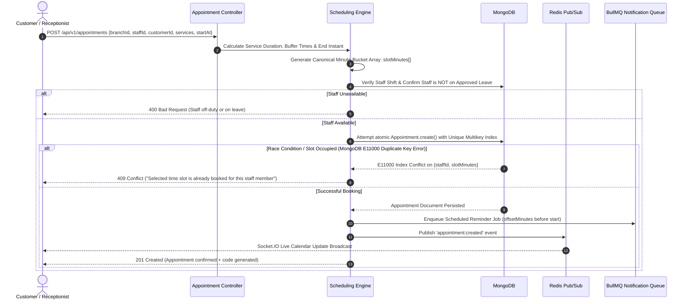
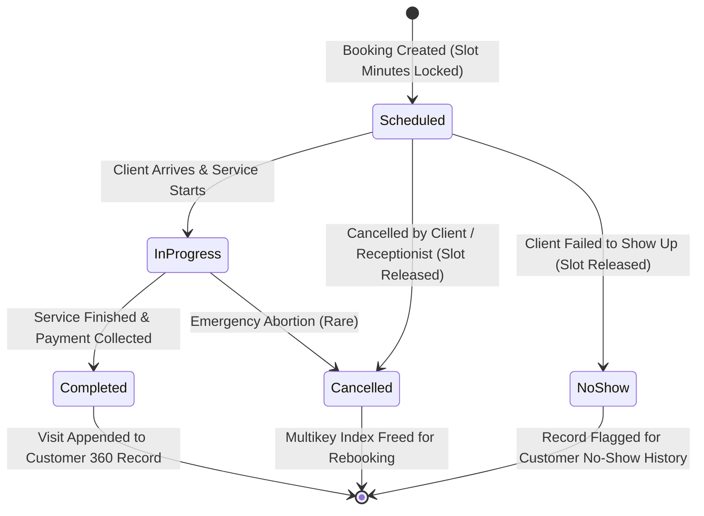
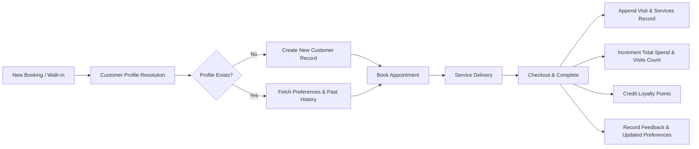

# Unisex Parlour ERP — Master Architecture & End-to-End Workflow Specification

---

## 1. Executive Summary & System Overview

**Unisex Parlour ERP** is an enterprise-grade, multi-tenant, multi-branch salon and parlour resource planning backend platform. It handles real-time appointment scheduling, zero double-booking concurrency control, staff scheduling and leave management, customer relationship history, role-based access control (RBAC), multi-channel asynchronous notifications (SMS/Email), and audit compliance.

### Core Objectives
1. **Multi-Tenancy & Strict Branch Data Scoping**: Isolation of business data by `organizationId` and `branchId`.
2. **Deterministic Scheduling Engine**: High-concurrency conflict resolution preventing overlapping bookings on staff or equipment using minute-bucket multikey indexes.
3. **Defense-in-Depth Security**: JWT access tokens paired with Refresh Token Rotation (RTR) and automatic breach detection, granular RBAC, speed limiters, and payload sanitization.
4. **Resilient Background Processing**: BullMQ and Redis queues to handle notification delivery, reminders, and background migrations without blocking synchronous HTTP threads.

---

## 2. Technology Stack & Runtime Topology

| Layer | Technology | Version / Tooling | Purpose |
| :--- | :--- | :--- | :--- |
| **Runtime** | Node.js | `>= 20.0.0` (ES Modules) | Core asynchronous runtime |
| **Framework** | Express | `5.2.1` | HTTP routing & middleware pipeline |
| **Primary Database** | MongoDB | `Mongoose 9.7.4` | Document store, transactional consistency, indexing |
| **Cache & Message Broker** | Redis | `ioredis 5.11.1` | Caching, session state, BullMQ backing queue |
| **Background Queues** | BullMQ | `5.81.1` | Reliable async worker execution & scheduled reminders |
| **Realtime Engine** | Socket.IO | `4.8.3` | Live calendar updates & notification push |
| **Security & Cryptography** | `bcryptjs`, `helmet`, `cors`, `jsonwebtoken` | Latest | Encryption, HTTP security headers, CORS isolation |
| **Traffic Shaping** | `express-rate-limit`, `express-slow-down` | Latest | DDoS mitigation, brute-force defense |
| **Validation** | Zod | `4.4.3` | Strict contract schema validation |
| **Logging & Monitoring** | Winston, Morgan | `3.19.0` | Structured JSON log aggregation and tracing |
| **Documentation** | Swagger / OpenAPI | `swagger-ui-express 5.0.1` | Interactive REST API documentation |

---

## 3. High-Level Architectural Diagram



---

## 4. Multi-Tenancy & Data Scoping Architecture

Every business entity in the ERP belongs to a hierarchical data scoping boundary:

```
Organization (Tenant Root)
  └── Branch A (Physical Salon Location)
  │     ├── Staff Members (Assigned to Branch A)
  │     ├── Services & Categories
  │     ├── Appointments & Schedule Buckets
  │     └── Customers (Associated Primary Branch)
  └── Branch B (Physical Salon Location)
        ├── Staff Members (Assigned to Branch B)
        └── ...
```

### Scoping Rules Matrix
1. **Super Admin / Org Admin**: Has global visibility across all branches within their `organizationId`.
2. **Branch Manager**: Restricted to managing staff, leaves, appointments, and customers within their assigned `branchId` list (`req.user.branches`).
3. **Operator / Staff Member**: Limited to their personal calendar, assigned tasks, and own profile/leave requests.
4. **Enforcement**:
   - Handled uniformly by `verifyBranchAccess()` middleware and service-level query injection:
     ```javascript
     if (!isGlobalAdmin(user)) {
       query.branchId = { $in: user.branches };
       query.organizationId = user.organizationId;
     }
     ```

---

## 5. Domain Models & Database Schemas

### 5.1 Authentication & Security Entities
- **`User`**: Base identity document (`name`, `email`, `phone`, `password`, `organizationId`, `branches`, `role`, `status: active|suspended|locked`, `failedLoginAttempts`, `lockUntil`).
- **`Session`**: Refresh token tracking (`userId`, `refreshTokenHash`, `ipAddress`, `deviceInfo`, `isValid`, `expiresAt`).
- **`Role` & `Permission`**: Granular role definitions containing permission arrays (`customer:create`, `appointment:book`, `staff:delete`, etc.).

### 5.2 Salon Operations Entities
- **`Organization`**: Tenant billing and branding profile.
- **`Branch`**: Physical salon outlet (`name`, `code`, `address`, `timezone`, `operatingHours`, `contactNumber`, `status: active|inactive`).
- **`Service` & `Category`**: Service catalog (`name`, `categoryId`, `durationMinutes`, `price`, `taxRate`, `genderTarget: male|female|unisex`, `bufferTimeBefore`, `bufferTimeAfter`, `isActive`).
- **`Staff`**: Stylist/operator profile (`userId`, `branchId`, `specializations`, `employmentType`, `shiftHours`, `rating`, `status: active|on_leave|inactive`).
- **`StaffLeave`**: Leave ledger (`staffId`, `branchId`, `leaveType`, `startDate`, `endDate`, `status: pending|approved|rejected|cancelled`, `approverId`, `comments`).

### 5.3 Customer 360 Entity
- **`Customer`**: Client profile (`name`, `phone`, `email`, `organizationId`, `branchId`, `loyaltyPoints`, `totalSpend`, `visitsCount`, `preferences`, `visitHistory`, `activityTimeline`, `isDeleted`).

### 5.4 High-Concurrency Appointment Entity
- **`Appointment`**: Complete booking lifecycle record:
  - Canonical UTC Instants: `startAt`, `endAt`
  - Local Interpretation: `appointmentDate` ("YYYY-MM-DD"), `startTime` ("HH:mm"), `endTime` ("HH:mm")
  - Minute Buckets: `slotMinutes: ["2026-09-14T10:00", "2026-09-14T10:01", ...]`
  - Financials: `subtotal`, `discount`, `tax`, `total`
  - Status: `scheduled` | `in_progress` | `completed` | `cancelled` | `no_show`
  - Reminders: Multi-channel status tracking (`email`, `sms`, `sendAt`, `offsetMinutes`)
  - **Multikey Unique Index for Zero Double-Booking**:
    ```javascript
    appointmentSchema.index(
      { organizationId: 1, staffId: 1, slotMinutes: 1 },
      {
        unique: true,
        partialFilterExpression: {
          isDeleted: false,
          status: { $in: ["scheduled", "in_progress"] },
          staffId: { $type: "objectId" }
        }
      }
    );
    ```

---

## 6. End-to-End Core System Workflows

```
                                ┌──────────────────────────────────────┐
                                │       1. AUTH & SESSION FLOW         │
                                └──────────────────┬───────────────────┘
                                                   │
                                ┌──────────────────▼───────────────────┐
                                │        2. RBAC & SCOPE GUARD         │
                                └──────────────────┬───────────────────┘
                                                   │
              ┌────────────────────────────────────┼────────────────────────────────────┐
              │                                    │                                    │
┌─────────────▼──────────────┐       ┌─────────────▼──────────────┐       ┌─────────────▼──────────────┐
│  3. STAFF & LEAVE ENGINE   │       │   4. APPOINTMENT ENGINE    │       │     5. CUSTOMER 360        │
└─────────────┬──────────────┘       └─────────────┬──────────────┘       └─────────────┬──────────────┘
              │                                    │                                    │
              └────────────────────────────────────┼────────────────────────────────────┘
                                                   │
                                ┌──────────────────▼───────────────────┐
                                │      6. BULLMQ ASYNC NOTIFIER        │
                                └──────────────────┬───────────────────┘
                                                   │
                                ┌──────────────────▼───────────────────┐
                                │      7. AUDIT & AUDIT COMPLIANCE     │
                                └──────────────────────────────────────┘
```

---

### Workflow 1: Authentication, Session Lifecycle & RTR Defense



---

### Workflow 2: Granular RBAC & Permission Resolution

1. **Token Extraction**: `authGuard` extracts JWT from `Authorization: Bearer <token>` or cookies.
2. **Hydration**: Decodes `userId`, `roleId`, and `branchIds`.
3. **Role Cache Check**:
   - Queries cached role permissions in Redis (TTL 5 mins).
   - If cache miss, loads from `Role` & `Permission` models in MongoDB and caches in Redis.
4. **Permission Evaluation**:
   - Route specifies `checkPermission("appointment:create")`.
   - Validates if the user's role contains `appointment:create` or wildcard `appointment:*` / `*:*`.
5. **Branch Authorization**:
   - Route specifies `verifyBranchAccess`.
   - Confirms `req.params.branchId` or `req.body.branchId` is within `req.user.branches` (or user is super-admin).

---

### Workflow 3: Staff & Leave Collision Resolution



---

### Workflow 4: Appointment Scheduling & Zero Double-Booking Engine



---

### Workflow 5: Appointment Status State Machine



#### Status Transition Rules:
1. **`scheduled`**:
   - `slotMinutes` occupied.
   - Triggers reminder workers.
2. **`in_progress`**:
   - Staff actively delivering service.
   - Cancellation requires administrative override reason.
3. **`completed`**:
   - `completedAt` timestamp stamped.
   - Automatically writes to customer visit history, calculates loyalty points, and generates billing transaction snapshot.
4. **`cancelled`**:
   - Releases slot constraint via partialFilter index exclusion.
   - Records `cancellation.cancelledBy`, `cancellation.reason`, and timestamp.
5. **`no_show`**:
   - Marks client record, increments customer no-show counter.

---

### Workflow 6: BullMQ Asynchronous Notification & Reminder Engine

1. **Queue Creation**:
   - `notificationQueue` backed by Redis instance.
2. **Job Scheduling**:
   - Upon appointment booking, calculate reminder trigger:
     $$\text{sendAt} = \text{startAt} - (\text{offsetMinutes} \times 60 \times 1000)$$
   - Add delayed job to BullMQ with `delay = sendAt - Date.now()`.
3. **Worker Processing (`notification.worker.js`)**:
   - Evaluates job payload: `{ appointmentId, channel: 'email' | 'sms' | 'both' }`.
   - Re-checks appointment status in DB (if cancelled/completed in interim, skips dispatch).
   - Renders template (HTML email / SMS string).
   - Dispatches via Nodemailer SMTP or SMS API.
   - Updates appointment reminder status: `sent` / `failed`.
4. **Automatic Retries & Exponential Backoff**:
   - 3 retry attempts with exponential backoff (1s, 5s, 15s) for transient gateway errors.

---

### Workflow 7: Customer 360° Profile & Lifetime Value Tracking



---

## 7. Security Architecture & Defensive Controls

```
                        INCOMING HTTP REQUEST
                                  │
                                  ▼
        ┌───────────────────────────────────────────────────┐
        │ 1. IP / Connection Filter & Nginx Proxy Trust     │
        └─────────────────────────┬─────────────────────────┘
                                  ▼
        ┌───────────────────────────────────────────────────┐
        │ 2. Helmet Security Headers (CSP, XSS, HSTS)       │
        └─────────────────────────┬─────────────────────────┘
                                  ▼
        ┌───────────────────────────────────────────────────┐
        │ 3. Strict CORS Origin Whitelisting                │
        └─────────────────────────┬─────────────────────────┘
                                  ▼
        ┌───────────────────────────────────────────────────┐
        │ 4. Speed Limiter & Express Rate Limiter           │
        └─────────────────────────┬─────────────────────────┘
                                  ▼
        ┌───────────────────────────────────────────────────┐
        │ 5. Payload Sanitization & Dotenv Route Blocker    │
        └─────────────────────────┬─────────────────────────┘
                                  ▼
        ┌───────────────────────────────────────────────────┐
        │ 6. JWT Authentication & RTR Breach Invalidation   │
        └─────────────────────────┬─────────────────────────┘
                                  ▼
        ┌───────────────────────────────────────────────────┐
        │ 7. Branch Scoping & Multi-Tenancy Boundary Check  │
        └─────────────────────────┬─────────────────────────┘
                                  ▼
        ┌───────────────────────────────────────────────────┐
        │ 8. Granular RBAC Permission Matrix Guard          │
        └─────────────────────────┬─────────────────────────┘
                                  ▼
        ┌───────────────────────────────────────────────────┐
        │ 9. Zod Input Schema Parse & Validation            │
        └─────────────────────────┬─────────────────────────┘
                                  ▼
                      CONTROLLER / SERVICE EXECUTION
```

---

## 8. Complete REST API Surface Overview

| Route Prefix | Resource Domain | Primary Responsibilities |
| :--- | :--- | :--- |
| `/api/v1/auth` | Authentication & Sessions | Login, Register, Refresh Token Rotation, Logout, Password Reset, Email Verification |
| `/api/v1/rbac` | Access Control | Roles, Permissions, Dynamic Permission Syncing, User Role Assignment |
| `/api/v1/branches` | Outlets & Tenancy | Branch CRUD, Operating Hours, Status Toggling, Branch Scoping |
| `/api/v1/services` | Service Catalog | Categories, Service definitions, Durations, Dynamic Pricing, Gender Tags |
| `/api/v1/staff` | Stylist & Staff | Staff Profiles, Working Schedules, Specializations, Commission/Rating data |
| `/api/v1/leaves` | Leave Management | Leave Application, Conflict Detection with Appointments, Manager Approvals |
| `/api/v1/customers` | Customer 360 | Profiles, Service history, Visits, Memberships, Loyalty Points, Preferences |
| `/api/v1/appointments` | Booking Engine | Slot Availability, Conflict-Free Booking, Rescheduling, Status Lifecycle, Check-in |
| `/api/v1/users` | User Accounts | System user management, Account status, Branch assignments |

---

## 9. Standardized API Response & Error Taxonomy

### 9.1 Success Response Envelope
```json
{
  "success": true,
  "message": "Operation completed successfully",
  "data": { ... },
  "pagination": {
    "page": 1,
    "limit": 20,
    "total": 154,
    "pages": 8
  }
}
```

### 9.2 Standardized Error Envelope
```json
{
  "success": false,
  "status": "fail",
  "message": "Selected time slot is already booked for this staff member",
  "errorCode": "SLOT_ALREADY_BOOKED",
  "statusCode": 409,
  "stack": "..." // Non-production only
}
```

---

## 10. Operational Runbook & Maintenance

### 10.1 Environment Configuration
Create a `.env` file in the root directory:
```env
PORT=5000
NODE_ENV=development
MONGO_URI=mongodb://localhost:27017/saloon_erp
REDIS_HOST=127.0.0.1
REDIS_PORT=6379
JWT_SECRET=your_super_secret_jwt_key
JWT_EXPIRES_IN=15m
REFRESH_TOKEN_EXPIRES_IN=7d
SMTP_HOST=smtp.mailtrap.io
SMTP_PORT=2525
SMTP_USER=your_smtp_user
SMTP_PASS=your_smtp_pass
```

### 10.2 Server Startup & Background Workers
```bash
# Install dependencies
npm install

# Sync RBAC permissions matrix into MongoDB
npm run permissions:sync

# Seed base roles and administrator account
npm run seed

# Start server with Nodemon (Hot-reload + BullMQ Workers + Redis + Express)
npm start

# Run test suite
npm test
```

### 10.3 Graceful Shutdown Protocol
When `SIGTERM` or `SIGINT` is received:
1. Stops incoming HTTP connections via `server.close()`.
2. Completes active BullMQ worker jobs and calls `stopNotificationWorkers()`.
3. Closes Redis connection pool cleanly via `disconnectRedis()`.
4. Closes MongoDB connection via `mongoose.connection.close()`.
5. Exits process safely with status `0`.

---
*Document Version: 1.0.0 | System: Unisex Parlour ERP Backend | Architecture Reference*
